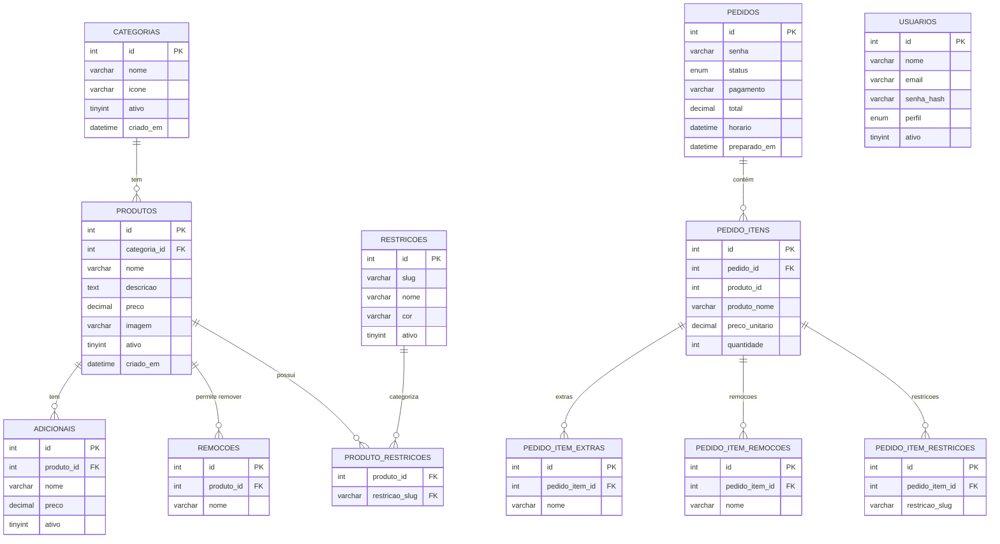

# Prontus

Sistema web para restaurantes que organiza pedidos feitos via totem de autoatendimento e os distribui digitalmente para a cozinha — eliminando comandas em papel e reduzindo gargalos em filas.

---

## Visão Geral

O Prontus cobre o fluxo completo de **pedido → preparo → retirada**, oferecendo:

- **Totem de autoatendimento** — cardápio interativo, personalização de itens, filtros alimentares e pagamento multimodal
- **Painel KDS (cozinha)** — pedidos em tempo real com alertas de restrição alimentar e controle de status
- **Tela pública de senhas** — exibição para TV com atualização automática
- **Painel administrativo** — CRUD completo de produtos, categorias e métricas do dia

---

## Estrutura do Projeto

```
prontus/
├── src/
│   ├── totem/          # Interface do cliente no totem
│   ├── kds/            # Painel da cozinha (KDS)
│   ├── display/        # Tela pública de chamadas de senha
│   ├── admin/          # Painel administrativo do gestor
│   └── shared/         # CSS, JS e imagens compartilhados
├── backend/
│   ├── api/            # Endpoints PHP
│   ├── config/         # Configurações de ambiente e banco
│   └── db/
│       └── migrations/ # Scripts de migração do banco
├── docs/               # Documentação e PRD
└── .github/
    ├── ISSUE_TEMPLATE/ # Templates de issues
    └── workflows/      # CI/CD (GitHub Actions)
```

---

## Diagrama do Banco de Dados



---

## Módulos

### Totem (Cliente)
- Navegação por cardápio categorizado
- Personalização dinâmica de itens (remover/adicionar ingredientes)
- Filtros de restrição alimentar (sem glúten, vegetariano etc.)
- Carrinho com resumo do pedido
- Pagamento via PIX, cartão ou dinheiro no caixa
- Geração automática de senha e check-in de fidelidade

### KDS — Painel da Cozinha
- Lista de pedidos ordenada por horário de entrada
- Exibição de personalizações e alertas de restrição alimentar
- Controle de status: **Recebido → Em preparo → Pronto → Finalizado**

### Tela Pública
- Senhas em preparo e prontas em tempo real
- Modo tela cheia para TV

### Painel Administrativo
- CRUD de produtos, categorias, preços e adicionais
- Configuração de restrições alimentares
- Métricas do dia: total de pedidos, tempo médio, volume de vendas

---

## Requisitos Não-Funcionais

| Requisito | Detalhe |
|---|---|
| Plataforma | Web responsiva (toque, TV, desktop) |
| Latência | Atualização em até 2 segundos |
| Capacidade (v1) | Até 500 pedidos/dia |
| Backend | PHP |
| Banco de dados | Interno da stack (com backup diário automático) |
| Controle de acesso | Perfis: Administrador e Cozinha |

---

## Indicadores de Sucesso (v1)

- 3+ restaurantes ativos por 30 dias
- Redução de erros operacionais reportada por 2+ clientes
- Redução de 15%+ no tempo médio de preparo
- 200+ pedidos processados na fase de validação

---

## Contribuindo

1. Crie uma branch a partir de `develop`: `git checkout -b feat/nome-da-feature`
2. Faça suas alterações e escreva commits descritivos
3. Abra um Pull Request para `develop` com o template preenchido
4. Aguarde revisão de pelo menos 1 membro da equipe antes do merge

Veja [.github/PULL_REQUEST_TEMPLATE.md](.github/PULL_REQUEST_TEMPLATE.md) e os [templates de issue](.github/ISSUE_TEMPLATE/) para mais detalhes.

---

## Licença

Este projeto está sob a licença MIT. Consulte o arquivo `LICENSE` para detalhes.
